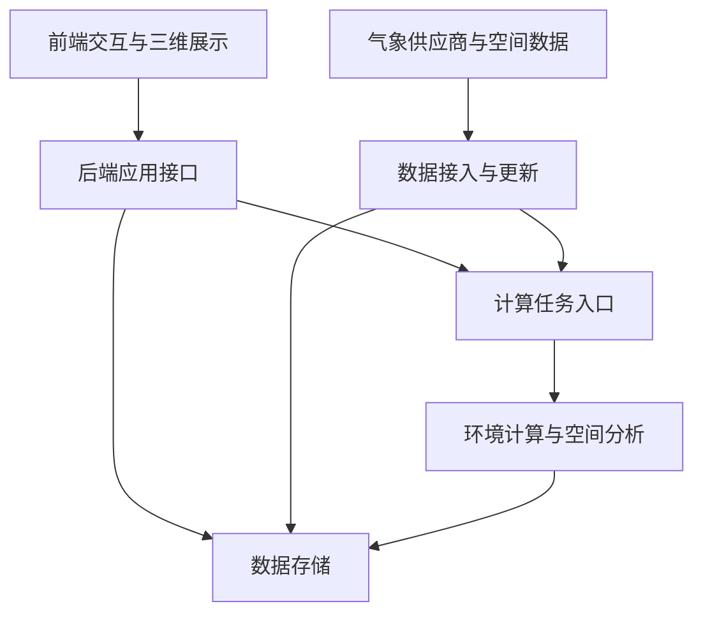

# 系统分层与模块架构

日期：2026-09-16；版本：v0.1。五层划分已经用户确认；模块与部署安排为细化设计，尚未实施。

## 1. 范围与设计依据

平台围绕上海实时客观热环境探索与 UGC 主观体感打卡建设。三维表现参考 sunlight-viewer，平台文档与工程在本目录独立维护。首页以地图交互为中心，研究模型在符合用途与验证条件时参与计算。

需求背景见[原始设计](实时热环境与UGC体感地图_原始设计.md)。常规气象见[实时气象视图详细设计](实时气象视图_详细设计.md)，辐射见[物理降尺度方案](太阳辐射物理降尺度方案.md)。早期常规气象文档的“不考虑太阳辐射”仅对应当时范围；当前架构包含辐射接入与有条件启用的局地计算，具体数据权限、含义及费用仍须分别核验。

## 2. 五层职责

| 层 | 模块 | 职责与边界 |
| --- | --- | --- |
| 1. 前端交互与三维展示 | 场景、图层、时间轴、位置查询、UGC 表单、个人记录 | 展示已发布结果，组织地图交互；屏幕光影不作为科学读数 |
| 2. 后端应用接口 | 场景目录、环境查询、打卡管理、身份与权限、导出 | 校验请求、组织业务和返回结果；不在地图查询请求中执行大规模射线计算 |
| 3. 环境计算与空间分析 | 背景气象处理、太阳与遮挡、天空因子、局地辐射、体感环境匹配 | 从版本化输入生成可追溯结果；不持有外部供应商调用职责 |
| 4. 数据接入与更新 | 和风气象、辐射源、城市要素导入、调度、质检、重试与预算 | 获取并规范化外部数据；错误输入不得直接进入可用产品 |
| 5. 数据存储 | PostGIS、文件存储、共享缓存、版本元数据 | 保存空间对象、UGC、原始响应、栅格和计算成果；区分缓存与持久记录 |

层次表示职责，不要求每次请求依次经过五层。应用接口可以直接读取存储中的已发布成果；UGC 写入经过身份与业务校验后进入数据库，再异步触发环境匹配。

## 3. 前后端模块边界

### 3.1 前端

- 场景模块：相机、地理坐标转换、建筑与树冠加载、对象拾取和视觉阴影。
- 图层模块：统一管理显隐、透明度、图例、覆盖、来源及加载状态。
- 环境探索模块：变量切换、时间选择、位置读数和当前估计/未来预报模式。
- UGC 模块：确认地点与体验时间、提交体感、查看附近记录、管理自己的记录。
- 公共状态模块：维护场景时刻、环境结果版本与 UGC 时间筛选。三者分别保存，不能用未来预报时间改写打卡时间。

### 3.2 后端应用

- 场景与图层目录：返回展示边界、资源地址、数据能力和可用时间范围。
- 环境查询：按位置、时刻、变量及结果版本返回数值、单位和质量状态。
- 任务状态：提供排队、计算中、失败及已发布状态；前端不控制供应商抓取频率。
- UGC 管理：身份校验、幂等提交、修改、删除、可见范围和公开位置精度控制。
- 导出：输出用户有权访问的结果与来源信息；公开导出遵守 UGC 可见范围和数据许可。

供应商密钥仅由服务端接入模块使用。允许前端读取的静态成果不包含凭据、私密记录或未授权的精确位置。

## 4. 关键业务链

### 4.1 实时更新

定时调度 → 获取新批次 → 保存原始响应 → 单位与时间规范化 → 质量检查 → 计算受影响产品 → 校验成果 → 发布结果清单 → 前端切换版本。

常规气象默认每 60 分钟刷新配置点集的 48 小时序列。辐射按经核验的产品更新规则调度；场景太阳随选定时刻变化。建筑与树冠更新触发几何缓存失效。上述频率分别管理。

每个产品可独立发布，单项失败不阻塞其他有效产品。跨产品查询返回各自来源版本与有效时间；只有时空与定义兼容时才执行合成计算。

### 4.2 地图浏览与查询

获取场景目录 → 获取所选产品的发布清单 → 加载对应版本图层 → 点选时携带相同结果版本查询。

一个产品的纹理、风矢量、图例与读数绑定同一版本。新版本未完整加载时保留旧版并提示更新；旧数据超出有效期后明确标为过期。查询位置超出覆盖或数据缺失时返回原因，不返回零值。

### 4.3 UGC 打卡

校验并保存体验 → 返回提交结果 → 异步匹配体验时空对应的环境 → 保存匹配记录 → 供有权限的详情与分析读取。

环境缺失不阻止提交。打卡修改地点或体验时间后创建新的匹配修订，保留追溯关系。公开位置模糊化不能覆盖用于授权分析的原始位置及精度信息。

## 5. 最小部署安排

初期建议一个前端、一个后端应用、一个后台任务进程、一个 PostgreSQL/PostGIS 实例，以及持久文件目录。后台任务进程承接接入与计算的独立模块，使耗时任务不阻塞地图和打卡接口。

前端构建方式与三维引擎承接现有可视化基础；后端框架在接口设计阶段确定。Redis、独立消息队列与对象存储按实际负载引入，不作为首版前提。

**数据库部署状态（2026-09-16 实测）**：PostgreSQL + PostGIS 在本机已实际可用，不再是"计划部署"——Windows 服务 `postgresql-x64-16` 运行中，`127.0.0.1:5432` 可达，服务器版本 `16.15`，PostGIS 扩展 `3.6.2` 已安装，数据库 `gis_thermal_shanghai` 含 `platform`、`public`、`topology` 三个 schema。但**部署可用不等于工程已接通**：当前 `platform` schema 由后端 `Base.metadata.create_all()` 自动建表，尚无版本化迁移脚本；后端与前端接口契约不一致，实际状态见[平台代码评审报告](平台代码评审报告_20260916.md)。

## 6. 后续细化顺序与验收

1. [环境计算与空间分析层](环境计算与空间分析层_详细设计.md)：确定可输出的物理量、时间和覆盖条件。
2. [后端应用接口](后端应用接口层_详细设计.md)：按用户最新安排优先细化，明确查询、任务、UGC 与导出的契约和权限。
3. 接入与存储：根据计算与接口契约规范化字段、质量状态、版本关系、迁移与缓存规则。
4. [前端交互与三维展示](前端交互与三维展示层_详细设计.md)：参考 sunlight-viewer 实际页面与源码，细化页面状态、图层联动、时间轴、打卡流程及性能降级。

系统验收至少覆盖：新数据成功更新；失败时保留并标识旧数据；地图与读数版本一致；缺测区别于零；UGC 可提交与管理；体验时间匹配可追溯；图表和地图时间筛选一致；专题地图与表格能够导出。相关结构在平台目录维护，不同步研究项目数据字典。
